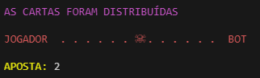
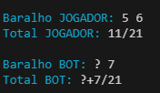
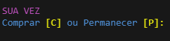
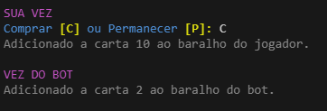
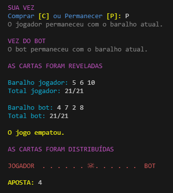
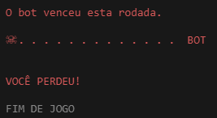

# 21 (Jogo de cartas) desenvolvido em Python
## `Sobre:`
O jogo de cartas "21", também conhecido como "Blackjack", é um jogo popular nos cassinos. O objetivo principal é ter uma mão com um valor total mais próximo de 21 do que a mão do dealer, sem ultrapassar esse número. 

## `Execução:`
1. Voce pode usar o git para clonar o repostitório ou copiar e colar o arquivo 'codigo.py'
2. É necessário ter acesso a um software onde se possa rodar o arquivo 'codigo.py', como um IDE ou pelo próprio terminal do computador.
3. Baixe e instale a versão mais recente do Python no site oficial.
4. Se estive no VS Code é necessário Instalar a Extensão Python.
5. Pelo terminal navegue até o diretório onde o arquivo Python está localizado usando o comando cd.
6. Execute o arquivo com um dos seguintes comandos: python nome_do_arquivo.py.

## `Como funciona o jogo:`
* Inicialmente aparecerá na tela o placar com uma caveira centralizada e o número da aposta que vai aumentando a cada rodada.
* Cada vez que alguém perder a rodada a caveira irá andar o número da aposta para a direita (caso o bot perca) ou para a esquerdar (caso o jogador perca).
* O jogo acaba quando a caveira chega no jogador ou no bot.

### `Início de partida:`

* Em seguida são apresentados os baralhos do jogador e do bot, também apresentando a soma total dos baralhos de cada um.
* Como regra do jogo uma das cartas do bot ficará oculta e não é somada as outras cartas, sendo revelada apenas no fim da rodada.

### `Baralhos:`

* O jogador inicia o jogo tendo que escolher se deseja comprar uma nova carta ou permanecer com o baralho atual.

### `Escolha:`

* Abaixo aparecerá a mensagem dizendo se uma carta foi adicionada ou se o jogador permaneceu com o baralho atual
* O mesmo vale para a vez do bot

### `Fim da rodada:`

* Assim que o jogador e bot escolhem ficar com o baralho atual, a rodada chega ao fim revelando as cartas e o vencedor ou se o jogo empatou.
* Uma nova rodada é iniciada com a caveira tendo andando o numero da aposta para direita ou para a esquerda dependendo do vencedor ou ficando no mesmo lugar caso haja um empate.

### `Fim do jogo:`

* As rodadas continuam até que a caveira alcance um dos dois revelando o vencedor final da partida.

